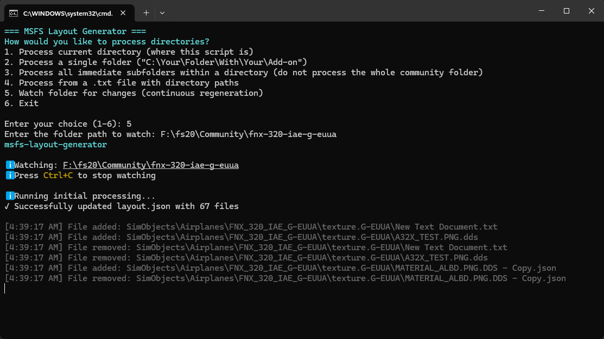

# 🛫 MSFS Layout Generator

   

A tool for **Microsoft Flight Simulator (MSFS)** developers to automatically generate and update `layout.json` files for their add-ons.


---  

## ✨ Features

- **Automatic Layout Generation**    
  Scans package directories and creates `layout.json` with file metadata

- **Watch changes in Package Directory**    
  Scans all changes in provided directory and updates `layout.json` accordingly

- **Manifest Integration**    
  Automatically updates `total_package_size` in `manifest.json`
- **Multiple Processing Modes**    
  Process single packages, multiple packages, or batch operations

- **Batch Processing**    
  Interactive Windows batch file with menu system for easy use

- **Flexible CLI**    
  Command-line interface with various options for different workflows

- **TypeScript Support**    
  Fully typed API for programmatic usage

---  

## 📦 Installation & Quick Start

### Windows batch file with menu system (recommended)

1. Download `msfs-layout-generator.bat` from the latest [release](https://github.com/p-sergienko/msfs-layout-generator/releases)
2. Place it in your desired directory
3. Double-click to run
4. Choose options from the interactive menu

### Manual Installation as a Global CLI Tool

```bash  
npm install -g msfs-layout-generator
```    
  
---  

## 💻 API Usage (For Developers)

Use your manager (npm, yarn, bun etc.) to install the package:
```bash  
npm install msfs-layout-generator
```      

### Simple Usage

```ts  
import { generateLayout } from 'msfs-layout-generator';  
  
// Process a single package (throws on errors, uses default options)
await generateLayout("F:\\fs20\\Community\\my-package");  
```  

### Advanced Usage with Options

```ts
import { processLayout } from 'msfs-layout-generator';
import type { ProcessOptions, ProcessResult } from 'msfs-layout-generator';

// Overwrite existing layout.json silently
await processLayout("./my-package", { force: true, quiet: true });

// Get a result object instead of throwing on errors
const result = await processLayout("./my-package", {
  returnResult: true,
  force: true
});

if (result.success) {
  console.log(`Processed ${result.fileCount} files (${result.totalSize} bytes)`);
} else {
  console.error(result.message);
}

// Generate layout without requiring or updating manifest.json
await processLayout("./my-package", {
  force: true,
  checkManifest: false,
  skipManifestUpdate: true
});
```

### Exports

| Export | Type | Description |
|---|---|---|
| `generateLayout(dir)` | `(dir: string) => Promise<void>` | Simple wrapper — processes a package directory with default options. Throws on errors. |
| `processLayout(dir, options?)` | `(dir: string, options?: ProcessOptions) => Promise<void \| ProcessResult>` | Full-featured function with configurable options. |

### `ProcessOptions`

| Option | Type | Default | Description |
|---|---|---|---|
| `force` | `boolean` | `false` | Overwrite existing `layout.json` |
| `quiet` | `boolean` | `false` | Suppress all console output |
| `debug` | `boolean` | `false` | Enable verbose debug logging |
| `checkManifest` | `boolean` | `true` | Require `manifest.json` to exist in the package directory |
| `skipManifestUpdate` | `boolean` | `false` | Skip updating `total_package_size` in `manifest.json` |
| `returnResult` | `boolean` | `false` | Return a `ProcessResult` object instead of `void`. When `true`, errors are returned in the result instead of thrown. |

### `ProcessResult`

Returned when `returnResult` is `true`:

| Field | Type | Description |
|---|---|---|
| `success` | `boolean` | Whether the operation completed successfully |
| `fileCount` | `number` | Number of files included in `layout.json` |
| `totalSize` | `number` | Total package size in bytes |
| `layoutPath` | `string` | Absolute path to the generated `layout.json` |
| `manifestPath` | `string` | Absolute path to `manifest.json` |
| `skippedFiles` | `number` | Number of files that were excluded |
| `message` | `string?` | Error message (when `success` is `false`) |

---  

**Happy Flying! ✈️** 